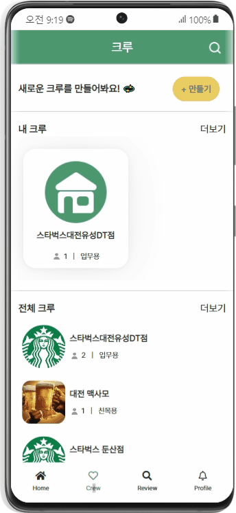

## blaA 링크 : https://i7b209.p.ssafy.io/

## 📅 **프로젝트 진행 기간**

2202.07.05(화) ~ 2022.08.19(금) (38일간 진행)

SSAFY 7기 2학기 공통프로젝트 - blaA

## 👥 blaA **- 배경**

최근 취업의 장벽이 높아지면서 단기근로자 즉, 알바생들이 많이 늘어나고 있습니다. 하지만 처음하는 일이고 매장의 환경을 모르니 여러 방면으로 일자리에 대한 정보를 모을려고 하는데 원하는 정보를 찾기가 힘듭니다

그래서 blaA는 알바 리뷰를 통해 자신이 원하는 매장의 정보를 찾고 한줄평 뿐만아니라 버튼식 평가로 한 눈에 확인되는 리뷰를 만들었습니다.

## 📜 blaA 개요

- ***내 알바, 내 알 바!***

blaA는 alba를 뒤집고(abla) 앞에 a를 뒤에다 두어 알바생(alba)들이 소통(블라블라)하는 공간입니다!

본인의 동료들과 업무적인 연락을 위한 크루 시스템으로 필요한 공지사항과 스케줄을 등록하여 기존에 불편했던 업무 확인이 보다 쉽게 할 수 있도록 구현하였습니다.

동료들 뿐만 아니라 전국의 알바생들이 일하는 모습을 오출완으로 확인하여 다양한 알바현장을 확인해볼 수 있고 근무지와 업종 필터링을 통해 나와 같은 지역에서 일하거나 같은 업종에서 일하는 사람들의 게시글을 필터링 할 수 있습니다.

## 💚 **주요 기능**

------

- **오출완**
  - 서비스 내 유저(주 타겟: 알바생)들이 자신이 알바하고 있는 현황이나, 출근 사진들을 공유하면서 소통할 수 있어요!
  - 게시글은 24시간이 지나면 사라지고, 자신이 팔로우하고 있는 유저들의 게시글이 먼저 나타납니다.
    - 게시글은 피드에서 24시간 후에 사라지지만 게시글 작성자는 마이페이지에서 해당 게시글을 조회할 수 있고, 원한다면 자신의 마이페이지에 나오게 할 수 있어요!
  - 해당 게시글에 좋아요/댓글 작성하여 유저들과 소통할 수 있습니다
- **리뷰**
  - 자신의 업장에 대한 평점(5점 척도)을 작성하고, 자신의 의견을 남길 수 있습니다. (한 줄 평, 장점, 단점 등)
  - 유저가 업장을 평가할 때, `‘사장님이 친절해요’`, `‘위생 관리가 잘 되고 있어요’`, `‘교통 접근성이 좋아요’` 등의 버튼을 눌러 간단하게 평가가 가능합니다
  - 리뷰 리스트에서 해당 버튼을 배너 형식으로 보며, 해당 업장의 장점을 구직자가 편리하게 볼 수 있습니다.
  - 해당 리뷰에 좋아요 버튼이 있어 도움이 많이 된 리뷰를 확인할 수 있습니다.
- **크루**
  - 업무용과 친목용을 나누어 필요한 목적에 따라 크루를 만들 수 있습니다.
  - 크루 내부에 공지사항과 스케줄러를 통해 크루 내부의 소통이 가능합니다.
  - 크루에 초대되어 있지 않더라도 크루에 들어가 게시글을 확인하여 해당 크루의 분위기를 확인 할 수 있습니다!
- **채팅**
  - 원하는 유저와 실시간으로 1:1 채팅이 가능합니다
- **팔로우**
  - 취향이 같은 유저를 팔로우해서 오출완에서 팔로우 한 사람의 글만 필터링 해서 볼 수 있어요

## ✔️ 주요기술

### BackEnd

- Python 3.9.13
- Django 3.2.12
- DjangoRestFramework 3.13.1

### 데이터베이스

- MySQL Workbench 8.0
- MySQL 8.0.27
- MariaDB 10.5
- SQLite 3.0
- firebase 8.10.1

### FrontEnd

- **vue** 3.2.13
- **vue-router** 4.0.13
- **vuex** 4.0.2
- **axios** 0.27.2
- **bootstrap** 5.2.0
- **firebase** 8.10.1
- **jwt-decode** 3.1.2
- **node.js** 16.14.2
- **v-calender** 3.0.0-alpha.8
- **mathjs** 11.0.1
- HTML5, CSS3, JavaScript(ES6)

### CI/CD 및 개발환경

- OS: Window 10
- IDE
- Visual Studio 1.70.0 

### Server : AWS EC2

- Ubuntu 20.0.4

- Docker 20.10.17

- Nginx 1.19.5

## 프로젝트 파일구조

**BackEnd**

```
BE
  ├── Tracing
  ├── accounts
  │   ├── kakao_key
  │   └──  tests
  ├── apiserver
  │   └──  settings
  ├── blacklists
  ├── categorys
  │   └── dumpdata
  ├── crews
  │   └── serializer
  ├── csv_to_db
  ├── media
  │   ├── basic
  │   ├── crew/image
  │   ├── store/logo
  │   └── user/profile
  ├── notification
  ├── review
  │   ├── dumpdata
  │   └── serializers
  ├── static
  └── stories
  └── serializers
```

**FrontEnd**

```
FE
  ├── node_modules
  ├── public
  └── src
      ├── api
      ├── assets
      │   ├── footer
      │   └── icons
      ├── components
      │   ├── chat
      │   ├── crew
      │   ├── review
      │   └── story
      ├── hooks
      ├── img
      ├── router
      ├── pages
      │   ├── account
      │   ├── chat
      │   ├── crew
      │   ├── home
      │   ├── notification
      │   ├── profile
      │   ├── review
      │   └──story
      └── store
      └── modules
```

## 프로젝트 결과물

### 1. 오출완 (오늘출근완료) 기능


​	blaA의 오출완 페이지에서는 다른 알바생들의 업무 환경에 대해 간접적으로 경험하고, 소통할 수 있습니다.  해당 페이지에서는 유저가 팔로우하고 있는 유저, 유저의 지역, 관심 업종에 대한 피드들을 필터링해 확인할 수 있으며, 해시태그 검색을 통해 자신의 관심 분야 스토리 또한 확인할 수 있습니다. 또한 blaA의 채팅 기능은 유저와 1:1 채팅을 통해 더 자세한 대화를 나눠 소통을 활성화하는데 기여하고 있습니다. 

또한 이러한 blaA의 SNS 기능은 관심 업종, 같은 지역내의 알바를 하는 사람들과의 연결고리가 되어, 다양한 크루를 생성하는데도 긍정적인 영향을 줄 것이라고 생각합니다. 위의 오출완 페이지를 보고 관심이 생긴 후에는 팔로우를 통해 팔로우를 하거나, 해당 닉네임으로 채팅기능을 통해 실시간 채팅을 할 수 있습니다.

### 2. 알바 리뷰 기능


​	blaA의 평점/리뷰 페이지에서는 다양한 가게들의 리뷰를 확인하고 작성할 수 있습니다. 먼저, 아르바이트생은 별점과 버튼을 클릭하여 비교적 간단히 업무환경에 대해 리뷰를 할 수 있습니다. 구직자의 가게에 대한 리뷰 통계와 한줄평, 세부 리뷰를 통해 업무 환경 및 특장점을 파악하여 구직시 불안감을 해소할 수 있습니다.

해당 기능의 신뢰성의 경우, 소셜로그인으로 사용자의 신상정보를 최대한 신뢰감있게 확보한 이후, 신고 기능으로 악의적인 리뷰나 허위 리뷰등을 작성하는 유저의 활동을 정지하거나 심할 경우, 신원을 확보하여 조치를 할 수 있게끔 설계하였습니다. 또한 위의 리뷰를 작성하기 전 이용 약관 모달창을 띄워, 사용자가 다시금 본인이 작성하는 리뷰에 책임감을 느끼도록 구성하였습니다.

### 3. 크루기능 1 - 크루게시판 기능



​	blaA의 크루 페이지에서는 함께 근무하고 있는 직원들과 업무 공유를 할 수 있는 업무용 크루 서비스, 아르바이트 생들끼리 자유롭게 소통하는 친목용 크루 서비스를 제공합니다. blaA의 크루 페이지에서는 공지사항, 메뉴얼, 스케줄등을 확인할 수 있습니다. 크루원은 상단 고정 게시물을 통해 중요 공지를 쉽게 확인할 수 있으며, 외부 유출에 민감한 정보는 비밀글 처리해, 팀원들끼리만 공유할 수 있습니다.

### 3. 크루 기능2 - 크루 스케쥴 공유 기능

.gif)


​	또한, 스케줄 기능을 이용해 자신과 크루원들의 일정을 공유할 수 있습니다.  크루가 아닌 유저도, 크루 페이지에 들어오면 업장의 분위기를 파악할 수 있으며 매장의 행사들도 게시판에서 확인 가능합니다. 


### 팀원 소개


