[toc]

# 빌드 및 배포 정리 문서

**담당자 : 김동완**

## 1. 프로젝트 기술 스택

가. 이슈관리 : Jira

나. 형상관리 : Gitlab

다. 커뮤니케이션 : Mattermost, Notion

라. 프로젝트 기획 

​	1) 와이어프레임 

​		가) FIGMA

​	2) ERD

​		나) ERD CLOUD

라. 개발 환경

​	1) OS: Window 10 

​	2) IDE

​		가) Visual Studio 1.70.0

​	3) DataBase 

​		가) MySQL Workbench 8.0

​		나) MySQL 8.0.27

​		다) MariaDB 10.5 

​		라) SQLite 3.0

​		마) firebase 8.10.1

​	4) Server : AWS EC2 

​		가) Ubuntu 20.0.4

​		나) Docker 20.10.17

​		라) Nginx 1.19.5

마. 상세사용 

​	1) Backend

​		가) Python 3.9.13

​		나) Django 3.2.12

​		다) DjangoRestFramework 3.13.1

​	2) Frontend

​		가) HTML5, CSS3, JavaScript(ES6)

​		나) Vue 3.2.13, Vue-router 4.0.13 , Vuex 4.0.2

​		다) Node.js 16.14.2 

​		라) axios 0.27.2, bootstrap 5.2.0, jwt-decode 3.1.2


## 2. 빌드 상세내용

#### *빌드 주의 사항* 

**B209팀에서 배포를 맡은 김동완입니다. 배포에 앞서 B209팀의 빌드 방식에 대한 개략적인 설명 후 정상적인 빌드 순서를 설명하겠습니다. **

- B209팀은 소스코드를 ubuntu 서버에 클론 받은 후 빌드를 진행하지 않았습니다.
- 부여받은 AWS 서버 내부에 웹 콘솔 Portainer를 설치 후 해당 콘솔에서 Image를 생성 시, 소스코드를 클론받고 빌드를 진행했습니다.
- Docker swarm을 이용해 Secret key를 관리했습니다. 
- Nginx를 로컬에서 생성 후 서버의 특정 경로 (/home/test)로 옮기고 Docker Volume으로 매칭되게 했습니다. 
- Backend는 8000, Frontend는 3000 port로 export 했으며, Nginx의 Proxy_header로 url에 따라 각 컨테이너로 요청을 보내게 진행했습니다. 

### 가. Docker 및 Portainer 설치

#### 1. 도커 설치

**가) 서버에 접속(실행 위치에 pem 키가 존재해야함 )**

```
ssh -i I7B209T.pem ubuntu@i7b209.p.ssafy.io
```

**나) 도커가 설치되어있는지 확인** 

```
sudo docker 
```

**다) 리눅스 기본 패키지 업데이트**

```
sudo apt-get update
```

**라) 도커 설치에 필요한 패키지 설치**

```
sudo apt install apt-transport-https \
				ca-certificates \
                curl \
                software-properties-common
```

**마) Docker 공식 GPG 키 추가**

```
curl -fsSL https://download.docker.com/linux/ubuntu/gpg | sudo apt-key add -
```

**바) stable repository 설정**

```
sudo add-apt-repository \
 "deb [arch=amd64] https://download.docker.com/linux/ubuntu \
 $(lsb_release -cs) \
 stable"
```

**사 ) apt update**

```
sudo apt-get update
```

**아 ) Docker 엔진 설치**

```
sudo apt-get install docker-ce docker-ce-cli containerd.io
sudo docker
```

**자) Docker Swarm 시작** 

```
sudo docker swarm init
```


#### 2. Portianer 설치

**가) portainer_data volume 생성**

```
sudo docker volume create portainer_data
```

**나) portianer container 설치 (port  9000:9000)**

```
sudo docker run -d -p 9000:9000 --name=portainer --restart=always -v /var/run/docker.sock:/var/run/docker.sock -v portainer_data:/data portainer/portainer-ce
```

**다) 설치 여부 확인**

```
sudo docker contianer ls 
```

#### 3. Portianer 실행 

**가) 부여받은 domain:9000을 URL 창에 입력** 

​	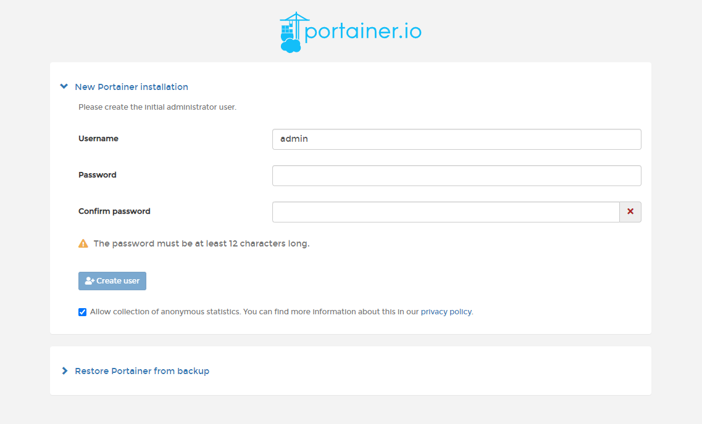

**나) Username과 Password 설정 후 Create User** 

**다) Docker 사용 선택** 

**라) Dashboard 확인**

​	

### 나. Backend, Frontend Docker Image 생성

**Portainer 내부에서 Docker Image 생성 시 gitlab clone을 진행합니다. 빌드 시 credential을 입력하지 않기 위해 사전에 Access token을 발급받습니다. **

**Backend, Frontend 이미지는 직접 gitlab에서 레포지토리를 clone 후 빌드하고, MariaDB, Nginx는 Docker Hub의 이미지를 사용합니다. **

#### 1. Gitlab Access Token 발급

​	가) 토큰 발급 페이지로 이동

- Settings > Access Tokens 

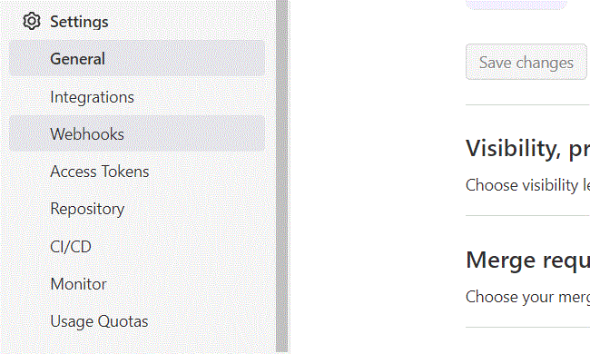

**나) 토큰 발급**

- Token 내용 입력 및 Scopes 체크 후 Create project access token 클릭

    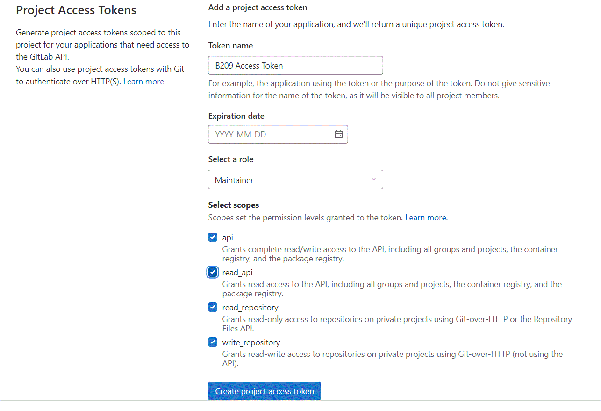

다) 발급된 토큰 복사 후 깃에 관리되지 않은 파일에 저장

#### 2. Backend Image 생성

**가) Dockerfile 생성** 

```dockerfile
FROM python:3.9.13

WORKDIR /home/

#gitlab access token
#https://lab.ssafy.com/s07-webmobile2-sub2/S07P12B209/-/settings/access_tokens
RUN git clone -b master https://asdf134652:<access_tokens>@lab.ssafy.com/s07-webmobile2-sub2/S07P12B209.git

WORKDIR /home/S07P12B209/BE

RUN pip install -r requirements.txt

RUN pip install gunicorn

RUN pip install mysqlclient

EXPOSE 8000

CMD ["bash", "-c", "python manage.py collectstatic --noinput --settings=apiserver.settings.deploy && python manage.py migrate --settings=apiserver.settings.deploy &&gunicorn apiserver.wsgi --env DJANGO_SETTINGS_MODULE=apiserver.settings.deploy --bind 0.0.0.0:8000"]
```

- Python 3.9.13 사용 
- WORKDIR /home으로 설정
- 최신버전의 깃 레포지토리 클론
- BE 폴더로 이동
- 패키지, gunicorn, mysqlclient 설치
- 8000 Port로 컨테이너 노출 
- 컨테이너 실행 시 static file 수집, migrate, gunicorn 실행

**나) Building Image**

​	**1) Portianer Image List로 이동 후 Build Image 클릭** 

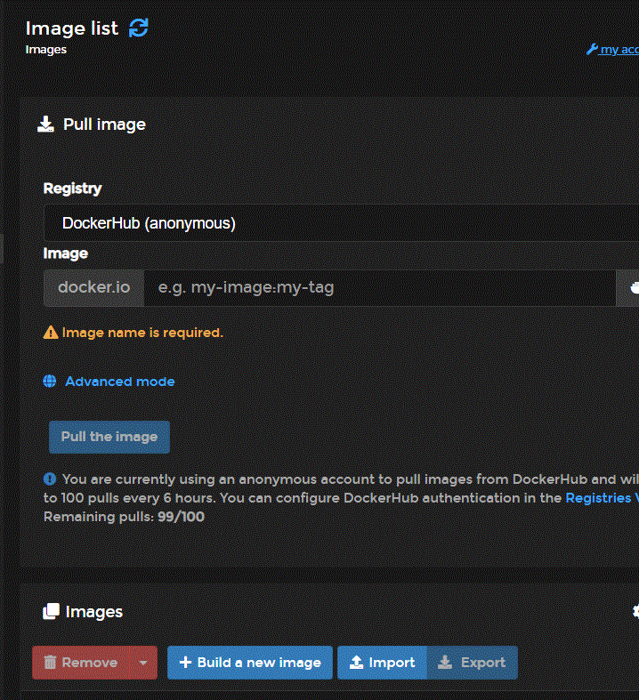

​	**2) 이미지 버전 명시 후 Dockerfile 입력** 

​	백엔드 이미지는 **be:tag**로 생성 

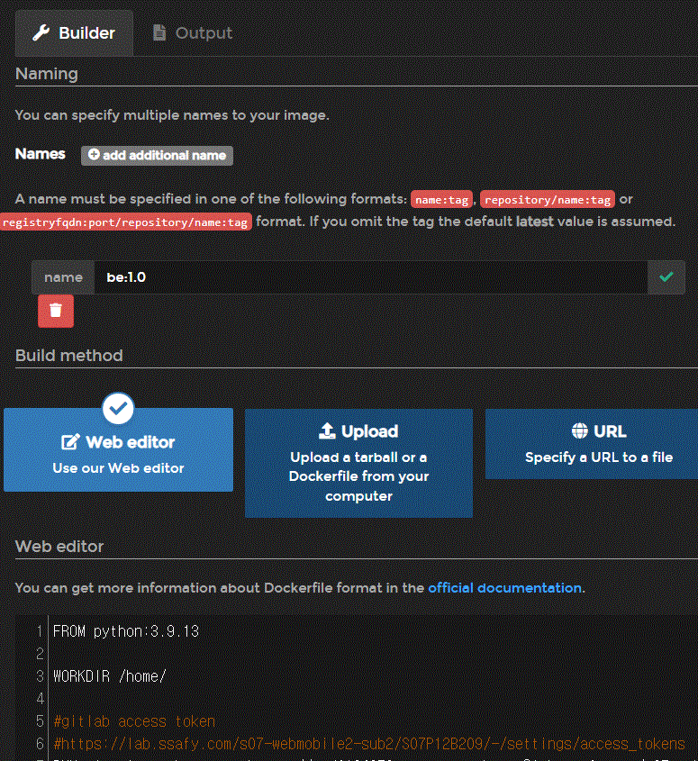

​	**3) 이미지 빌드** 

#### 3. Frontend Image 생성

**가) Dockerfile 생성** 

```dockerfile
FROM node:12.18
WORKDIR /home/

RUN echo "fe_test:0.1"

#gitlab access token
#https://lab.ssafy.com/s07-webmobile2-sub2/S07P12B209/-/settings/access_tokens

RUN git clone -b develop https://asdf134652:<access_tokens>@lab.ssafy.com/s07-webmobile2-sub2/S07P12B209.git

# RUN echo $(pwd /home/)

WORKDIR /home/S07P12B209/FE/blaa

RUN npm install
RUN npm install --save @popperjs/core

EXPOSE 3000

CMD ["npm", "run", "serve"]
```

- Node 12.18 사용 
- WORKDIR /home으로 설정
- 최신버전의 깃 레포지토리 클론
- FE/blaa 폴더로 이동
- 패키지 설치
- 3000 Port로 컨테이너 노출 
- 컨테이너 실행 커맨드 `npm run serve`

**나) Building Image**

- 백엔드와 동일 


### 다. Docker stack 생성 

**사전 준비 사항**

- Docker Stack으로 빌드를 위한 Secrets 작성을 진행합니다.

- Local에서 Nginx 파일을 작성합니다. 

#### 1. Secret 

​	**가) Portainer Secrets list로 이동** 

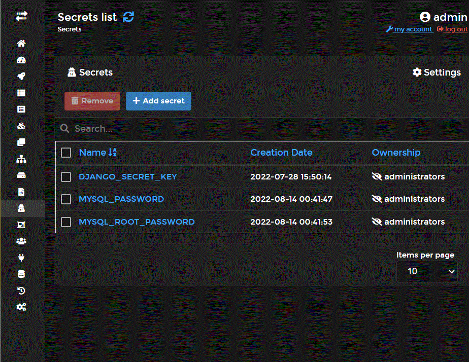

​	**나) Django 구동을 위한 Secret Key 입력**

​	**다) Mysql 환경변수  MYSQL_PASSWORD, MYSQL_ROOT_PASSWORD입력**

#### 2. Nginx

​	**가) Nginx 파일 작성** 

```nginx
  worker_processes auto; 

  events {
  }
  
  #http 서버 역할 
  http {
    client_max_body_size 50M;
    server {
    listen 80;
    server_name i7b209.p.ssafy.io;
    # access_log  /var/log/nginx/example.log;
    include mime.types;

    
    location /static/{
      alias /data/static/;
    }
    location /media/{
      alias /data/media/;
      client_max_body_size 50M;
    }
    #서버 URL에 `/api` 이후로 요청이 들어오면 backend contianer로 이동
    location /api {
      client_max_body_size 50M;
      proxy_pass http://backend:8000; #api ip and port
      proxy_set_header Host $host;
      proxy_set_header X-Forwarded-For $proxy_add_x_forwarded_for;
      }
    #이외의 URL 요청은 frontend container로 이동
    location / {
        client_max_body_size 50M;
        proxy_pass http://frontend:3000;
        proxy_set_header Host $host;
        proxy_set_header X-Forwarded-For $proxy_add_x_forwarded_for;
    }
  }

}
```

- server name 입력
- static file과  media file의 location 설정
- 서버 URL에 `/api` 이후로 요청이 들어오면 backend contianer로 이동
- 이외의 URL 요청은 frontend container로 이동

​	**나) Nginx 파일 이동** 

- Filezila 실행

- 서버 연결 

    - 로그온 유형을 키 파일로 설정 후 I7B209.pem 파일 등록 

    - 22포트로 연결 

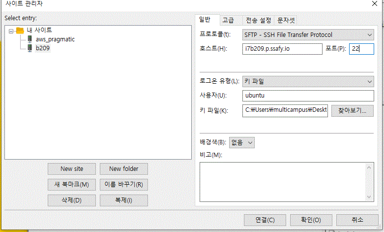

​	**다) test 폴더 생성 및 권한부여** 

```
sudo mkdir test
sudo chmod 777 test/
```

​	**라) 로컬에서 작성한 Nginx 파일을 해당 경로로 이동** 

- docker-compose.yml의 volume으로 nginx.conf 파일을 해당 파일로 이용하기 위함 

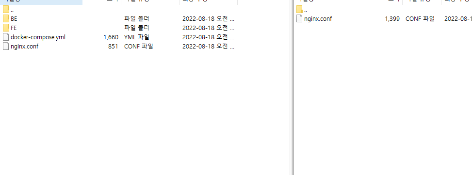

#### 3. docker-compose.yml 작성

```dockerfile
version: '3.7'
services:
  #nginx
  nginx:
  	#nginx 1.19.5 version image 사용 
    image: nginx:1.19.5
    networks:
      - network
    #nginx 파일 연동, static, media volume 설정 
    volumes:
      - /home/test/nginx.conf:/etc/nginx/nginx.conf
      - static-volume:/data/static 
      - media-volume:/data/media
    # 기본 80포트와 SSL 인증을 위한 443 포트 사용 
    ports:
      - 80:80 
      - 443:443
  # 컨테이너 이름으로 소통이 진행되므로, nginx에 명시한container이름으로 지어주자
  frontend :
    image : fe:1.0
    networks:
     - network
  # 컨테이너 이름으로 소통이 진행되므로, nginx에 명시한container이름으로 지어주자
  backend:
    image: be:1.0
    networks:
      - network
    volumes:
      - static-volume:/home/S07P12B209/BE/staticfiles 
      - media-volume:/home/S07P12B209/BE/media 
    #DB연결을 위한 Django secret key와 Mysql password는 secret list에서 가져옴 
    secrets :
      - MYSQL_PASSWORD
      - DJANGO_SECRET_KEY
	#mariadb
  mariadb:
  #mariadb 10.5 version 이미지 사용 
    image: mariadb:10.5
    networks:
      - network 
    volumes:
    # 경로는 docker hub에 명시된 /var/lib/mysql로 설정
      - maria-database:/var/lib/mysql 
    # mariadb secret을 만들 때 _FILE이라는 접미사로 설정할 수 있고, secret의 경로를 제공
    secrets:
      - MYSQL_PASSWORD
      - MYSQL_ROOT_PASSWORD 
    #환경변수 등록 
    environment:
      MYSQL_ROOT_PASSWORD_FILE : /run/secrets/MYSQL_ROOT_PASSWORD
      MYSQL_DATABASE : b209
      MYSQL_USER : b209 
      MYSQL_PASSWORD_FILE : /run/secrets/MYSQL_PASSWORD
    ports:
      - 33061:3306

networks:
  network:

volumes:
  static-volume: 
  media-volume:
  maria-database: 
      
secrets:
  DJANGO_SECRET_KEY:
    external: true 

  MYSQL_PASSWORD:
    external: true 

  MYSQL_ROOT_PASSWORD:
    external: true
```


### 라. 서버 배포

#### 1. Add Stack

​	**가) Portainer Stacks list로 이동**

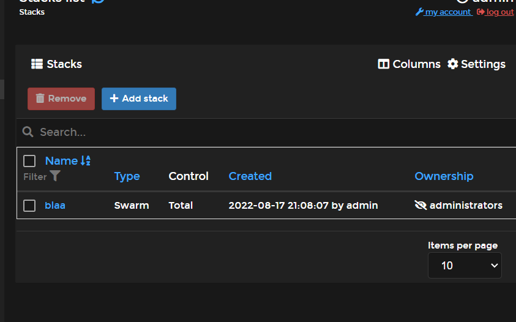

​	**나) 스택 이름 입력 및 docker_compose.yml 내용 복사**

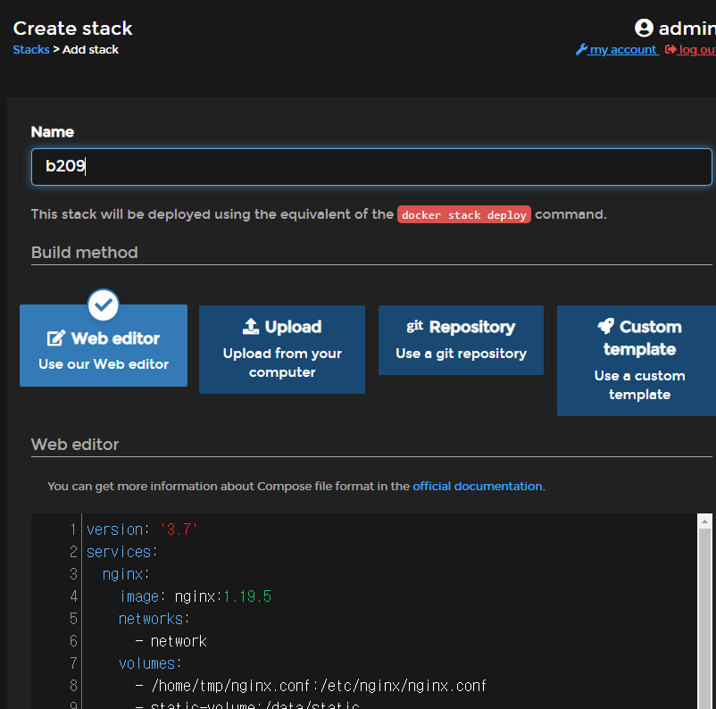

​	**다) Deploy Stack**

​	**라) 생성된 컨테이너 확인** 

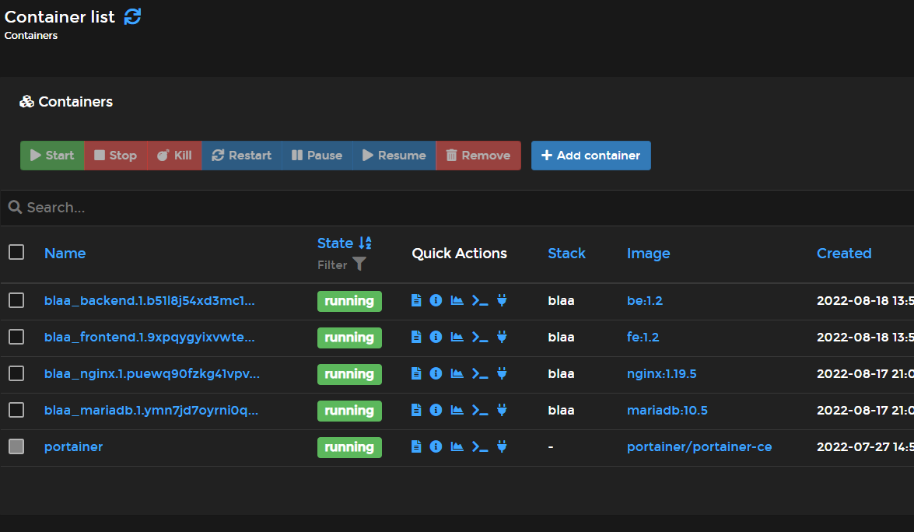


#### 2. 웹 서버(Nginx)에 SSL 인증 적용

​	**가) 컨테이너 내부 Nginx 콘솔로 이동** 

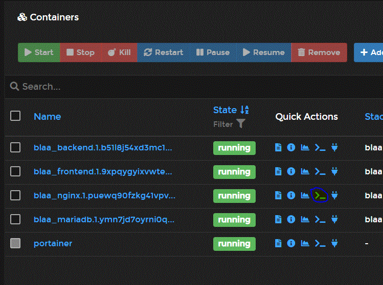

​	**나) connect 버튼 클릭으로 콘솔 실행** 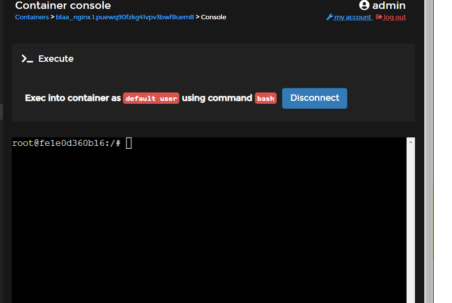

​	**라) Certbot 설치**

```
$ apt-get update
$ apt install certbot
#Y
$ apt install python-certbot-nginx
#Y
$ certbot --nginx
#A
#Y
#1
#2
```

​	**마) SSL 인증 확인**

```
cat /etc/nginx/nginx.conf
```

```
  worker_processes auto; 

  events {
  }
  
  #http 서버 역할 
  http {
    client_max_body_size 50M;
    server {
    server_name i7b209.p.ssafy.io;
    # access_log  /var/log/nginx/example.log;
    include mime.types;

    
    location /static/{
      alias /data/static/;
    }
    location /media/{
      alias /data/media/;
      client_max_body_size 50M;
    }
    location /api {
      client_max_body_size 50M;
      proxy_pass http://backend:8000; #api ip and port
      proxy_set_header Host $host;
      proxy_set_header X-Forwarded-For $proxy_add_x_forwarded_for;
      }
    location / {
        client_max_body_size 50M;
        proxy_pass http://frontend:3000;
        proxy_set_header Host $host;
        proxy_set_header X-Forwarded-For $proxy_add_x_forwarded_for;
    }
  
    listen 443 ssl; # managed by Certbot
    ssl_certificate /etc/letsencrypt/live/i7b209.p.ssafy.io/fullchain.pem; # managed by Certbot
    ssl_certificate_key /etc/letsencrypt/live/i7b209.p.ssafy.io/privkey.pem; # managed by Certbot
    include /etc/letsencrypt/options-ssl-nginx.conf; # managed by Certbot
    ssl_dhparam /etc/letsencrypt/ssl-dhparams.pem; # managed by Certbot

}


    server {
    if ($host = i7b209.p.ssafy.io) {
        return 301 https://$host$request_uri;
    } # managed by Certbot


    listen 80;
    server_name i7b209.p.ssafy.io;
    return 404; # managed by Certbot
```

​	**바) 배포된 서버 확인**

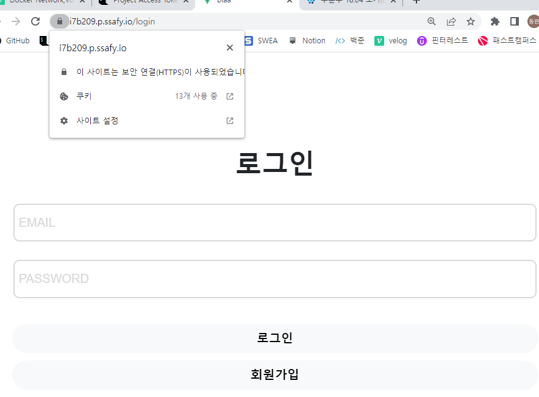


#### 3. 백엔드 세팅

​	**가) dumpdata load**

​		1) backend container console로 이동

​		2)  load data

```
python manage.py loaddata categorys/dumpdata/dong.json categorys/dumpdata/sido.json categorys/dumpdata/gugun.json categorys/dumpdata/jobcategory.json  reviews/dumpdata/buttonreview.json --settings=apiserver.settings.deploy
```

​	**나) superuser 생성**

​		1) backend container console로 이동

​		2) createsuperuser 

```
python manage.py createsuperuser --settings=apiserver.settings.deploy
```

​		3) credential 입력 

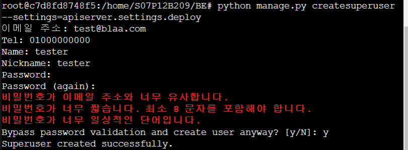

​		4) admin page 이동 후 로그인 여부 확인

​	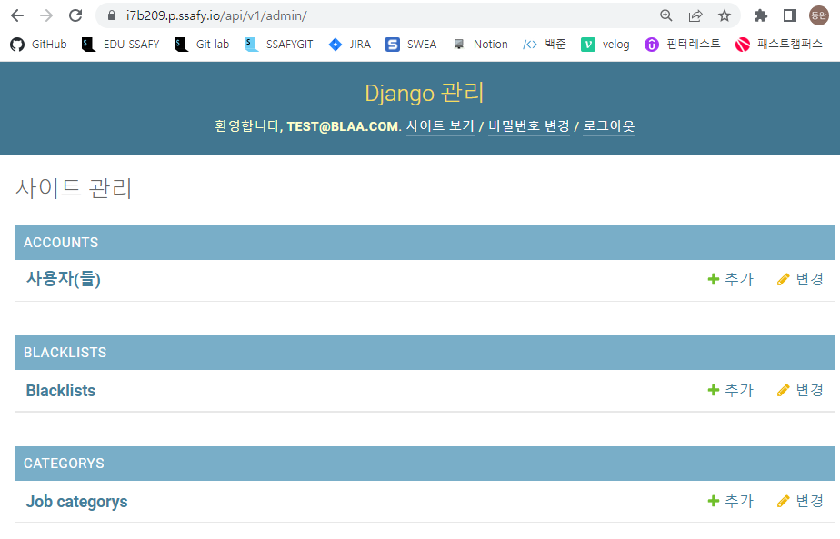

#### 4. Mysql Workbench 사용 방법

​	**가) Mysql Workbench 실행**

​	**나) Setup new connection**

​	**다) Parameters 입력** 

​		1) Host name : url

​		2) Port : 33061

​		3) Username : root (or 생성한 user) 

​		4) Password : MYSQL_ROOT_PASSWORD(or MYSQL_USER_PASSWORD)

​	**라) Connection**

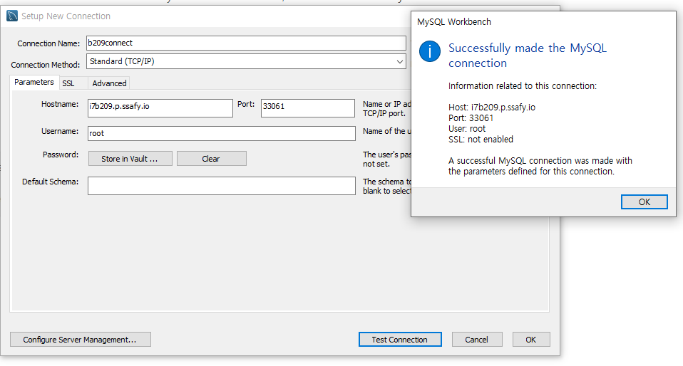


### 마. 서버 버전 변경

**###** 

#### 1. 새로운 버전 태그로 Image 생성

- **이미지 생성 방법은 목차의 나.Backend, Frontend Docker Image 생성 - Image 생성 방법과 동일** 

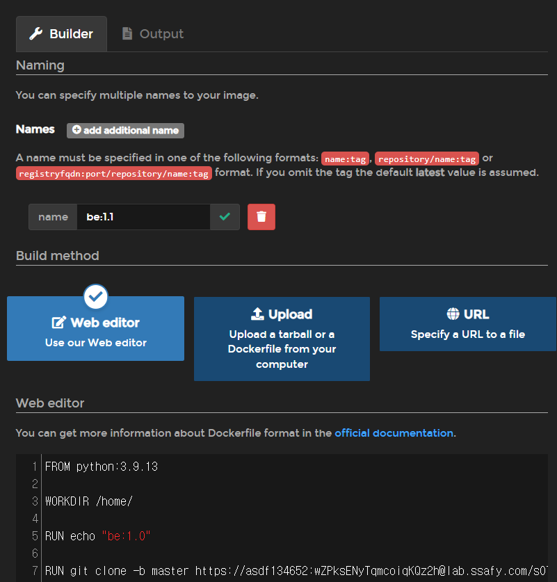

#### 2. Docker Stack 변경

- 배포한 Stack으로 들어가 Editer 클릭 
- 변경할 Image의 버전 변경 

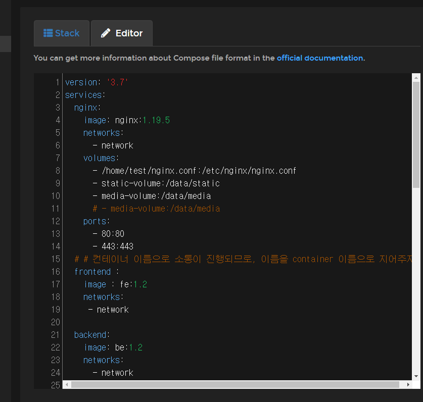

- Update stack 버튼 클릭 

**Frontend 기준 30초, Backend 기준 5초 이후 빌드에 에러가 없을 시 새로운 버전으로 배포 완료**

