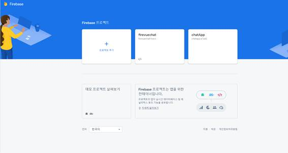
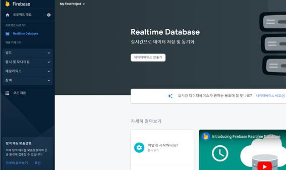
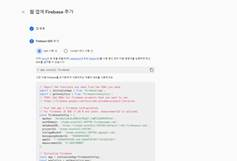
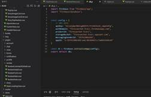
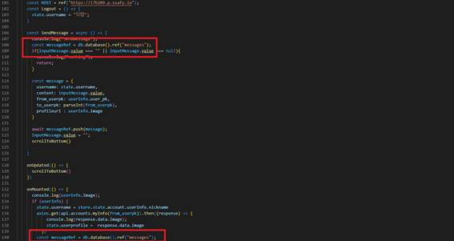
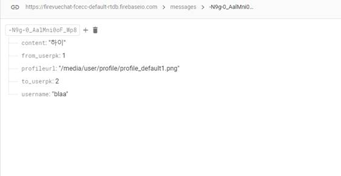
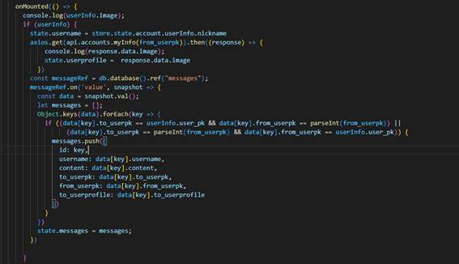
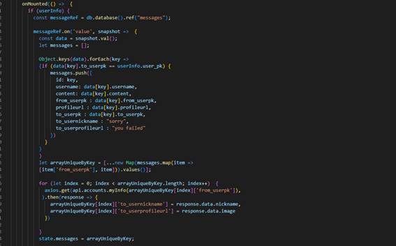

[toc]

# 파이어베이스

**담당자: 권혁림**

### 1. 카카오로그인 사용 개요

 유저끼리의 실시간 소통과 편한 채팅 로그 관리를 위해서 파이어베이스를 이용하여 채팅 기능을 구현하였습니다. 파이어 베이스에서 Realtime Database를 사용하여 실시간을 바뀌는 정보를 반응형으로 나타나게 구현하였고 각자의 채팅방을 구현하기 위해서 받아오는 데이터들을 필터와 유니크 키를 통하여, 쾌적하고 빠르게 채팅을 할 수 있도록 서비스를 제공하기 위해 노력하였습니다.

### 2. 서비스  설정 

#### **가. 파이어베이스에 데이터 베이스 생성**  

  파이어베이스 데이터베이스를 사용하기 위해서는 먼저 파이어베이스 홈페이지에서 새로운 프로젝트를 생성합니다. 이때 새로운 프로젝트를 클릭하여, 데이터베이스의 이름을 입력합니다.   

 

 

 

 

 

 

  필요한 정보를 입력한 후, 새로운 프로젝트가 생성이 되면 이 프로젝트 안에서 여러 종류의 데이터베이스를 사용할 수 있습니다. 만약 이미지 파일까지 사용하고 싶을 경우, Storage나 Firestore Database까지 사용할 수 있지만, 채팅의 실시간 기능만 사용할 것이기 때문에, 빌드탭에 Realtime Database를 선택하여 데이터베이스를 만들어줍니다. 기본 설정은 미국시간, 테스트 모드로 설정을 저장합니다.

 

#### **나. 생성된 파이어베이스 웹 어플리케이션에 적용하기**

 기본설정을 완료한 이후, 직접 웹 코드에 들어가서 src 폴더 밑에 db.js파일을 생성하여, firebase를 불러옵니다. 이때 config 설정에 firebase에 있는 api key를 복사하여 붙어넣어 줍니다. api key는 생성된 새로운 프로젝트 데이터베이스를 Web app으로 등록할시 Add Firebase SDK 항목에서 볼 수 있습니다. 아래처럼 생성된 데이터 베이스를 웹 앱에 추가하기를 하면, Firesbass SDK 추가 항목에 api key들이 쉽게 복사할 수 있도록 나옵니다. 이들을 그 다음 그림과 같이 db.json에 넣어 설정해줍니다. 

##### **데이터베이스 활용**

사전 설정이 끝난 후 이를 직접 데이터베이스를 이용하여, 사용할 수 있습니다. 백엔드 서버를 활용할때는 모델을 미리 작성하고 이에 맞게 api를 설정하여 주고 받는 형식이 있다면, 파이어베이스의 실시간 데이터베이스는 위와 같은 과정이 불필요 합니다. 미리 데이터베이스를 만들기 전에 어느 정도의 Schema는 설계를 해야하지만, 실제 Vue코드에서 데이터 모델을 유연하게 바꾸고 설정할 수 있습니다. 

### 3. 데이터베이스 활용 

#### **가. 파이어베이스로 Vue에서 데이터 보내기**

  db.json 설정이 완료된 이후, 데이터베이스를 사용할 해당 Vue 파일에서 db를 import 해주고 어떤 이름으로 쿼리를 저장할 것인지 코드를 작성해줍니다. 

 

위의 빨간 박스를 친 것처럼 저장할 때와 받아올 때 해당 쿼리들을 하나로 묶을 수 있는 이름을 설정해줍니다. 채팅의 경우엔 messages로 설정해주었습니다. 그리고 첫 번째 박스 아래처럼 어떠한 방식으로 messages에 message를 저장할 것인지 쿼리를 생성하여, 이를 messageRef에 push해주면, 해당 쿼리 그대로 firebase에 아래처럼 저장이 완료됩니다. 

 

#### 나. 파이어베이스에서 Vue로 데이터 받기

파이어베이스에서 데이터를 받을 때에는 onMounted 함수를 사용하여 페이지가 생성되기전에 firebase데이터를 호출하여, 데이터를 받았습니다. 이또한 데이터를 받고 사용자가 원하는 형태로 vue component 리스트에 저장이 가능합니다. 해당 데이터를 messageRef로 받고 이에 대한 key값들( 가 과정에서 데이터를 보낼 때 사용한 쿼리 변수들)에 따라 데이터 리스트에 딕셔너리 형태로 저장합니다. 그 후 데이터를 다 받았으면, 이를 state에 저장하여 실시간으로 화면상 변경이 가능하도록 합니다. 중간의 if 문은 1대1 채팅시 해당 user_pk값들로만 저장된 data를 받기위해서 설정하였습니다.

 

 

위와 같은 과정들을 통해 if문으로 사용자가 원하는 데이터만 불러올 수 도 있고 , 데이터들을 모두 불러온 이후, filter 함수와 uniquekey 등을 통해 데이터를 전처리하여 사용할 수 도 있습니다. 채팅방의 경우에는 채팅방 변수를 autofield로 하나 만들어서 사용할 수도 있었지만, 이번 제작 과정에서는 그보다 filter와 Unique키 값을 사용한 함수를 만들어 가장 최근메세지와 보낸 사람의 프로필을 뜨게하는 채팅목록을 아래와 같이 코드를 짜서 사용하였습니다.

 

 

 

 

 